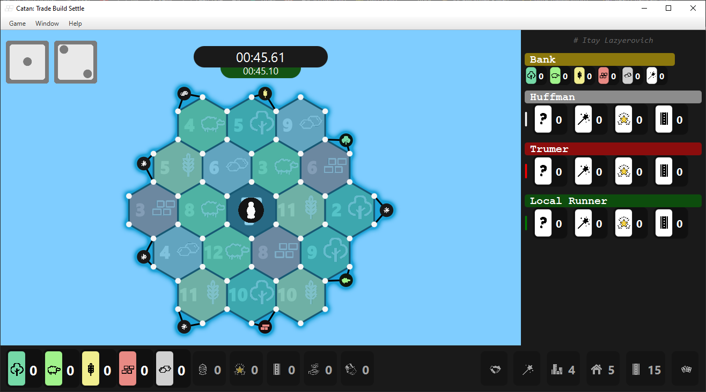
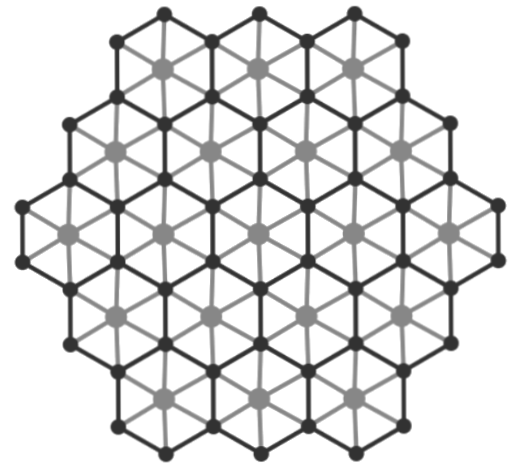

# CatanFX

Collage Finale Project.

Recreating Catan experience using javafx and c language, in client-server architecture.

worked between the start of february till the mid of june.

## How to Run:

the client is in this branch while the server is in another branch called "model". the client is written to run in any system/os, but the model currently only runs in linux for some reason (opening socket didnt work in my windows).

to run the client do `make`, and install maven if you dont have it on your local machine.

## Game rules

single player and 1 to 2 enemy bots, not all the rules are the same as the familiar catan.

## Screenshot

### Game

### Model Graph

